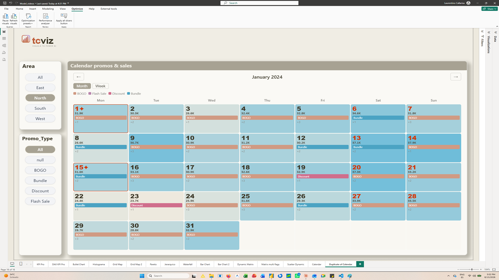
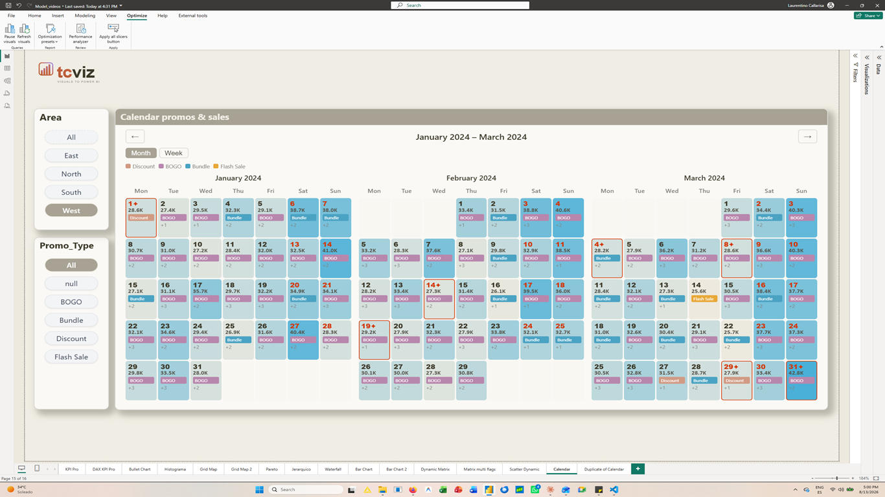
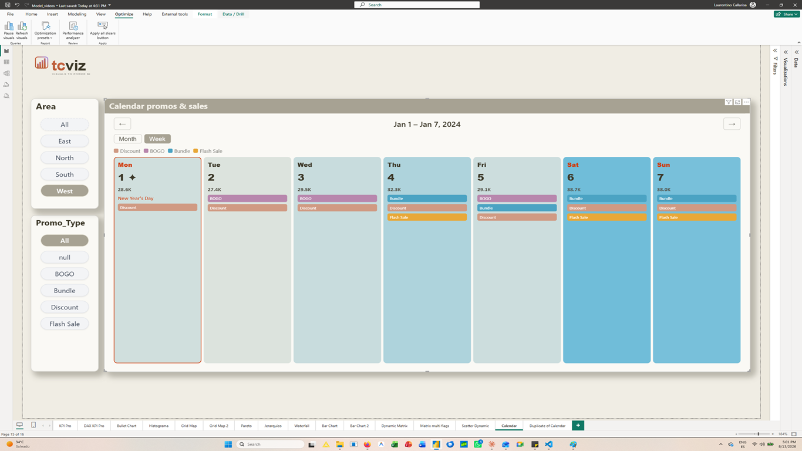

# Calendar Events Heatmap

**A Power BI custom visual by [TCViz](https://github.com/tinocallarisa-web).**
Daily KPI intensity and dated business events on one calendar surface — promotions,
campaigns and holidays shown alongside the measure they moved.

**[Get it on Microsoft Marketplace](https://marketplace.microsoft.com/en-us/product/power-bi-visuals/tino_callarisa.calendar-events-heatmap)** — free tier, no licence required.

[Product page](https://tcviz.com/product/calendar-events-heatmap/) ·
[Documentation](https://tinocallarisa-web.github.io/calendar/support.html) ·
[Changelog](https://tinocallarisa-web.github.io/calendar/changelog.html) ·
[Video tutorial](https://www.youtube.com/watch?v=FUELmlkAGNI) ·
[Report an issue](https://github.com/tinocallarisa-web/calendar/issues) ·
[Questions & ideas](https://github.com/tinocallarisa-web/calendar/discussions)



---

## The problem it solves

Power BI can show a daily measure, and it can list your promotions and holidays. Doing
both at once normally means two visuals and a mental join — read the spike in one, then
hunt for what was running that week in the other.

This visual puts them in the same cell. Each day is shaded by your measure and carries
badges for whatever was happening on it, so the question *"what happened on the days
performance changed?"* is answered by looking, not by cross-referencing.

Typical uses: retail promotion tracking, marketing campaign calendars, staffing and
attendance overviews, service and maintenance planning, holiday impact analysis.

---

## Quick start

1. Drop the visual on the page and connect a **Date** column and a **Main Measure**.
2. Optionally add **Event Name** and **Event Category** to get badges, and
   **Holiday Name** to mark holidays.
3. Tune the colours and density under **Format → Heatmap Colors** and **Events**.

> **The one setup mistake worth knowing about.** If your dates render as `1900` or as
> year numbers, Power BI is sending its auto date hierarchy instead of dates. In the
> field well, click the **▼** next to your date field and pick **Date**, not *Date
> Hierarchy*. Or turn the hierarchy off entirely under *File → Options → Current file →
> Data Load → Auto date/time*.

There are sample CSVs in this repo — [`sample_sales.csv`](sample_sales.csv),
[`sample_events.csv`](sample_events.csv) and [`sample_holidays.csv`](sample_holidays.csv)
— if you want to try it before wiring up your own model.

---

## Field wells

| Field well | Kind | What it does |
|---|---|---|
| **Date** | Grouping | The calendar date. Connect as a date, not a hierarchy. |
| **Main Measure** | Measure | Drives the heatmap shading and the value printed in each day. |
| **Tooltip Measures** | Measure | Extra measures shown in the tooltip only. Multiple fields supported. |
| **Event Name** | Grouping | Text of the event badge. |
| **Event Category** | Grouping | Groups events for colour coding, and drives the legend. |
| **Holiday Name** | Grouping | Marks the day as a holiday. The date comes from the Date field. |

---

## What it does

**Calendar** — month and week views, one to twelve months side by side, configurable
week start, and fiscal calendars with a custom year-start month.

**Heatmap** — gradient from your min to max colour across the visible range, with a
separate colour for days that have no data, so an empty day never reads as a low one.

**Events** — badges inside the day cell, coloured per category with an in-visual legend,
or a single colour for everything. A cap on badges per day keeps dense months readable,
with a `+N` counter for the overflow.

**Report integration** — standard tooltips and report tooltip pages, cross-page
filtering with multi-select, bookmarks, conditional formatting on the day colour, and
the measure's own format string honoured throughout, including dynamic format strings.





---

## Accessibility

The calendar is a real grid, not a picture of one.

- **Keyboard.** `Tab` enters the grid once; arrows move by day and week, `Home`/`End`
  jump to the ends of the week, `Page Up`/`Page Down` change month or week, `Enter` or
  `Space` filters the report, `Ctrl`+`Enter` adds to the selection, `Esc` clears it and
  `Shift`+`F10` opens the Power BI context menu. Moving past the edge navigates and
  keeps focus on the day you moved to.
- **Screen readers.** Every day announces its full date, the measure value, the holiday
  name and the events on it.
- **High contrast.** Under a Windows high-contrast theme the visual stops using fill
  colour to carry meaning: the heatmap intensity becomes border weight, badges and
  legend swatches switch to an outlined style, and everything takes the theme's own
  foreground and background.

---

## Free and Pro

Everything below works without a licence, in both tiers: the KPI heatmap, event badges
with automatic category colours, holiday overlay, tooltip measures and report tooltip
pages, cross-page filtering, bookmarks, conditional formatting, keyboard navigation and
high contrast.

**Pro** adds the week view, one to twelve months side by side, a configurable number of
event badges per day, per-category colour pickers, and the full format pane. Every
install starts with a 30-day Pro trial — no card required — and falls back to Free when
it ends.

---

## Documentation and support

- **[Product page](https://tcviz.com/product/calendar-events-heatmap/)** — features, pricing and screenshots.
- **[Marketplace listing](https://marketplace.microsoft.com/en-us/product/power-bi-visuals/tino_callarisa.calendar-events-heatmap)** — install it, download the sample report, or
  start the 30-day Pro trial.
- **[Full documentation](https://tinocallarisa-web.github.io/calendar/support.html)** —
  quick start, field wells, complete format pane reference, report integration,
  accessibility and FAQ, with search.
- **[Changelog](https://tinocallarisa-web.github.io/calendar/changelog.html)** — what
  changed in every release.
- **[Video tutorial](https://www.youtube.com/watch?v=FUELmlkAGNI)** — the visual set up
  end to end.
- **[Issues](https://github.com/tinocallarisa-web/calendar/issues)** — bug reports and
  feature requests. Please use the templates; they ask for the version and environment
  details that make a report actionable.
- **[Discussions](https://github.com/tinocallarisa-web/calendar/discussions)** —
  questions, ideas and setup help.
- **Licence and billing** — <support@tcviz.com>.

---

## Privacy

The visual makes no network calls. It reads only the data you connect to its field
wells, and its settings are stored in your report file. Licence validation goes through
Power BI's own licensing API, not a server of ours. Full detail in the
[privacy policy](https://tinocallarisa-web.github.io/calendar/privacy.html) and the
[terms of use](https://tinocallarisa-web.github.io/calendar/terms.html).

---

## Building from source

```bash
npm install
npx pbiviz package        # production build → dist/
node build-test.js        # test build with Pro unlocked, GUID suffixed _test
node tools/build-changelog.js   # regenerate changelog.html from CHANGELOG.md
```

Requires the [Power BI Visuals Tools](https://www.npmjs.com/package/powerbi-visuals-tools).
The `certification` branch mirrors what is published to AppSource.
